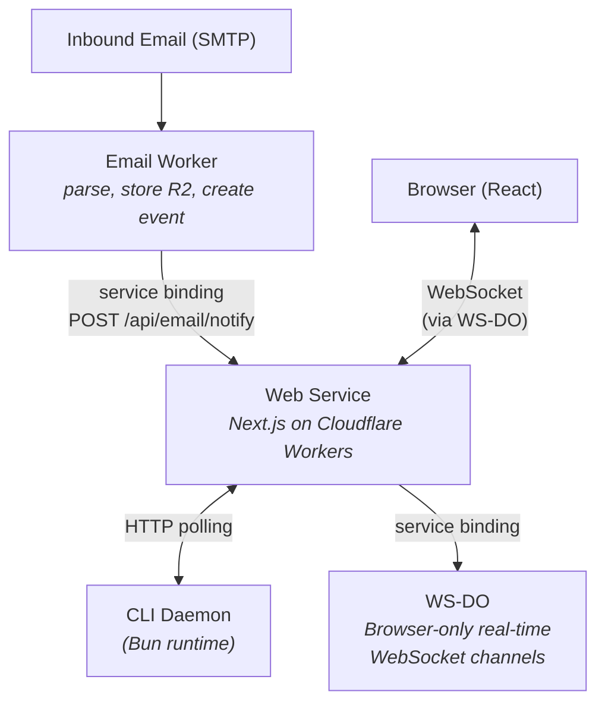
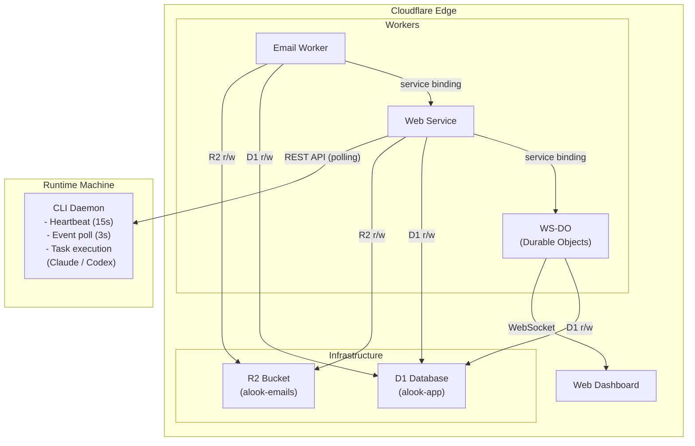

# Alook

Email-driven autonomous agent platform. Users create AI agents with email handles — when an agent receives an email, a runtime machine executes the task using Claude or Codex and streams results back to the dashboard in real time.

## Architecture



### Service Relationships



## Services

| Service | Package | Location | Runtime | Purpose |
|---------|---------|----------|---------|---------|
| **Web** | `@alook/web` | `src/web` | Cloudflare Workers (OpenNext) | Dashboard, REST API, auth, database |
| **Email Worker** | `@alook/email-worker` | `src/email-worker` | Cloudflare Worker | Inbound email parsing, storage, event creation |
| **WS-DO** | `@alook/ws-do` | `src/ws-do` | Cloudflare Durable Objects | Real-time WebSocket channels per agent/user |
| **CLI** | `@alook/cli` | `src/cli` | Bun | Runtime daemon, task execution, agent orchestration |
| **Shared** | `@alook/shared` | `src/shared` | Library | Types, constants, validation utilities |

## Tech Stack

- **Frontend:** Next.js, React, Tailwind CSS, Base UI
- **Backend:** Next.js API routes on Cloudflare Workers
- **Auth:** Better Auth
- **Database:** Cloudflare D1 (SQLite)
- **Storage:** Cloudflare R2
- **Real-time:** WebSockets via Durable Objects
- **AI Runtimes:** Claude Code, Codex, Opencode
- **CLI Runtime:** Bun
- **Monorepo:** Turborepo + pnpm workspaces
- **Testing:** Vitest

## Getting Started

```bash
pnpm clean            # remove node_modules, build artifacts, local D1 state
pnpm install          # install dependencies
pnpm db:migrate       # set up local D1 database
pnpm dev              # start web + workers (excludes CLI)
```

## Development

```bash
pnpm install          # install dependencies
pnpm dev              # start web + workers (excludes CLI)
pnpm dev:cli          # start CLI separately (requires Bun)
pnpm db:migrate       # run D1 migrations locally
pnpm db:reset         # wipe local D1 and re-migrate
pnpm test             # run all tests
pnpm typecheck        # typecheck all packages
```

### Individual services

```bash
pnpm dev:web          # Next.js dev server on :3000
pnpm dev:email        # Email worker on :8788
pnpm dev:cli          # CLI daemon (Bun)
pnpm dev:send <from> <to> [subject] [body]   # simulate inbound email
```

## Key Workflows

**Email reception:** SMTP -> Email Worker -> parse & store in R2/D1 -> create event -> notify web service -> web service broadcasts via WS-DO to browser -> CLI picks up event via HTTP polling

**Task execution:** CLI receives event -> creates task record -> runs Claude/Codex agent with prompt -> streams output chunks to API -> marks complete -> dashboard updates in real time

**Runtime registration:** CLI `register <token>` -> detects local runtimes (claude, codex) -> registers with Web API -> starts daemon (polling)
