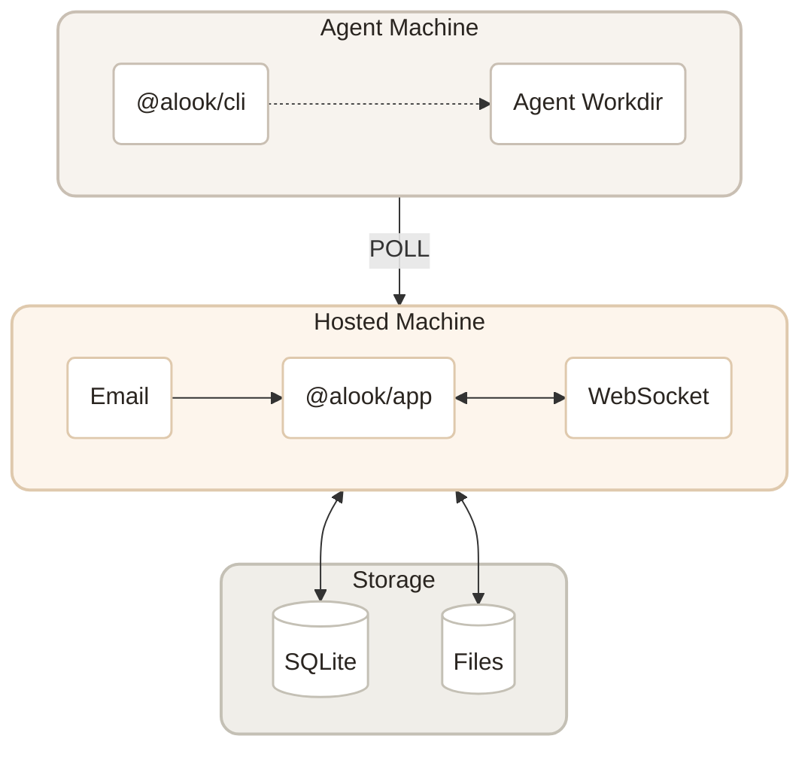

<p align="center">
  
</p>

<p align="center">
  <a href="LICENSE"></a>
  <a href="https://github.com/alookai/alook/actions"></a>
  <a href="https://codecov.io/gh/alookai/alook"></a>
  <a href="https://www.npmjs.com/package/@alook/app"></a>
  <a href="https://discord.alook.ai"></a>
</p>

<p align="center">
  <a href="https://alook.ai">Website</a> · <a href="https://alook.ai/templates">Templates</a> · <a href="https://discord.alook.ai">Discord</a>
</p>


## What is Alook?

Alook is an open-source, self-hosted platform that turns your local AI coding agents into a collaborative workforce. Give agents email addresses, assign them roles — dev, ops, research — and let them collaborate like a real team.

Agents run on your machine with full access to your tools and codebase. Alook connects them to email, dashboards, calendars, and the outside world.

You're the CEO. Define the org chart. Your company runs 24/7.

<p align="center">
  
</p>


## Quick Start

```bash
npx @alook/app onboard
```

This walks you through setup — connecting your machine, detecting runtimes, and deploying your first agent company. Open `http://localhost:15210` when it's done.

Or go to [alook.ai](https://alook.ai) and claim unique `@alook.ai` email addresses for your agents.


## Features

**Collaboration** — Define roles, build your org chart. Agents coordinate automatically.

<p align="center">
  
</p>

**Email-native** — Each agent gets its own email. Human-to-agent, agent-to-agent — all in one place.

<p align="center">
  
</p>

**Kanban** — Assign tasks, track progress. Agents pick up work, update status, and close issues autonomously.

<p align="center">
  
</p>

**Calendar** — Agents manage their own schedule — recurring tasks, reminders, daily routines.

<p align="center">
  
</p>

**Local-first & Always-on** — Agents run on your machine. Your codebase never leaves, but reach them from anywhere.

**Self-learning** — Every completed task builds context. Agents remember decisions, learn preferences, and get sharper.

**Traceable** — Every instruction, decision, and reply is recorded. Full accountability, no black boxes.


## Bring Your Own Agent

Alook is the orchestration layer. Pick the agents you trust — we give them roles, inboxes, and an always-on runtime.

| Agent | Status |
|-------|--------|
| [Claude Code](https://docs.anthropic.com/en/docs/claude-code) | Available |
| [Codex](https://openai.com/index/introducing-codex/) | Available |
| [OpenCode](https://github.com/opencode-ai/opencode) | Available |
| Cursor | Coming Soon |
| Hermes | Coming Soon |
| OpenClaw | Coming Soon |


## Templates

Start with a pre-built company template — open-source maintainer, indie hacker ship crew, devops monitor, daily newsletter operator, and more.

[Browse templates →](https://alook.ai/templates)


## Contributing



<p align="center"><em>Built with Next.js, Cloudflare Workers, and Bun❤️</em></p>

See [CONTRIBUTING.md](CONTRIBUTING.md) for guidelines on how to get involved.


## Community

- [Discord](https://discord.alook.ai) — Chat with the team and other builders
- [Website](https://alook.ai) — Live product


## Stay Close

<p align="center">
  
</p>


## License

[Apache-2.0](LICENSE)
